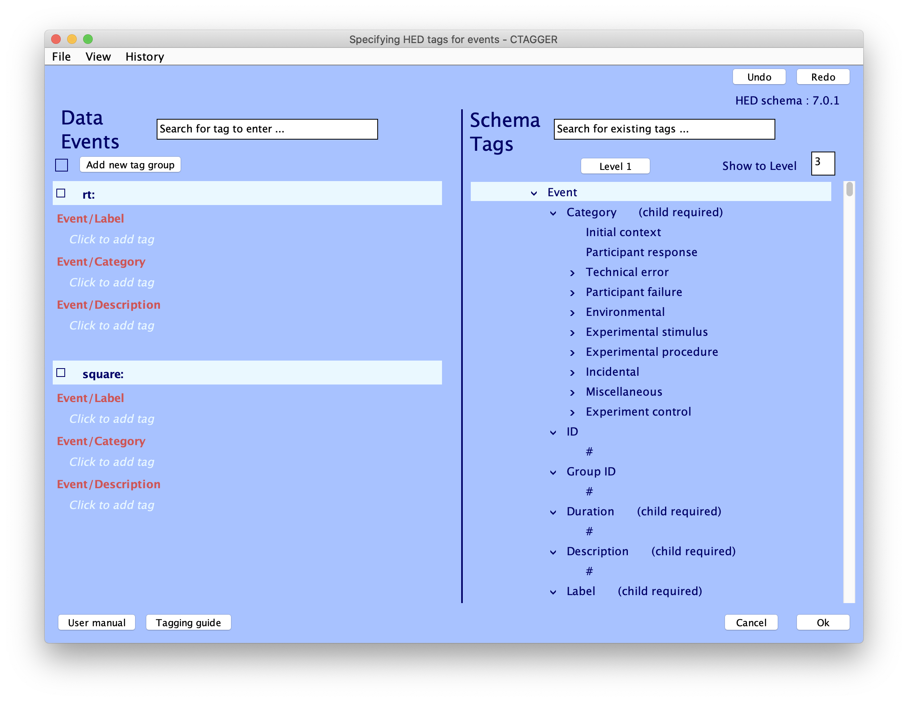
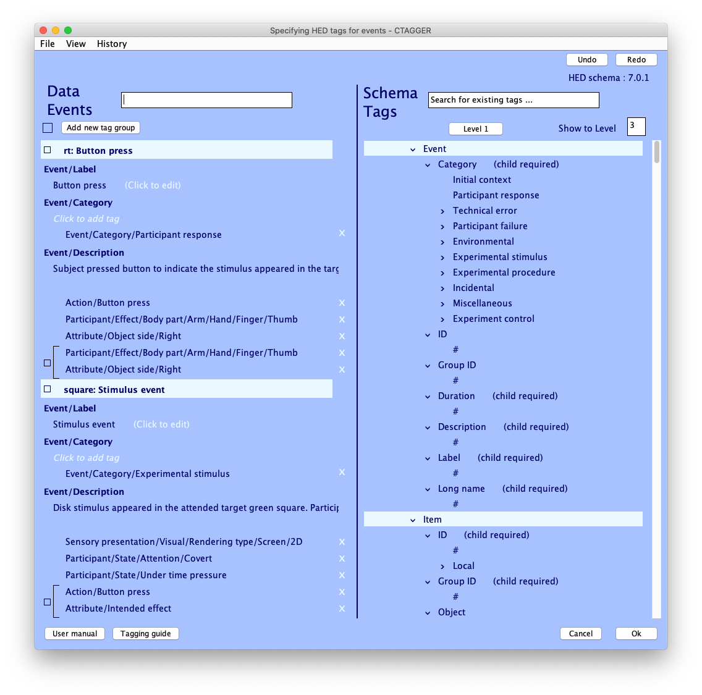
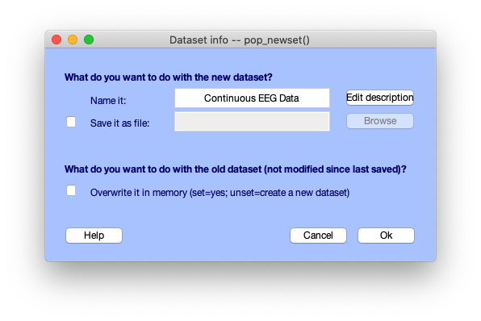
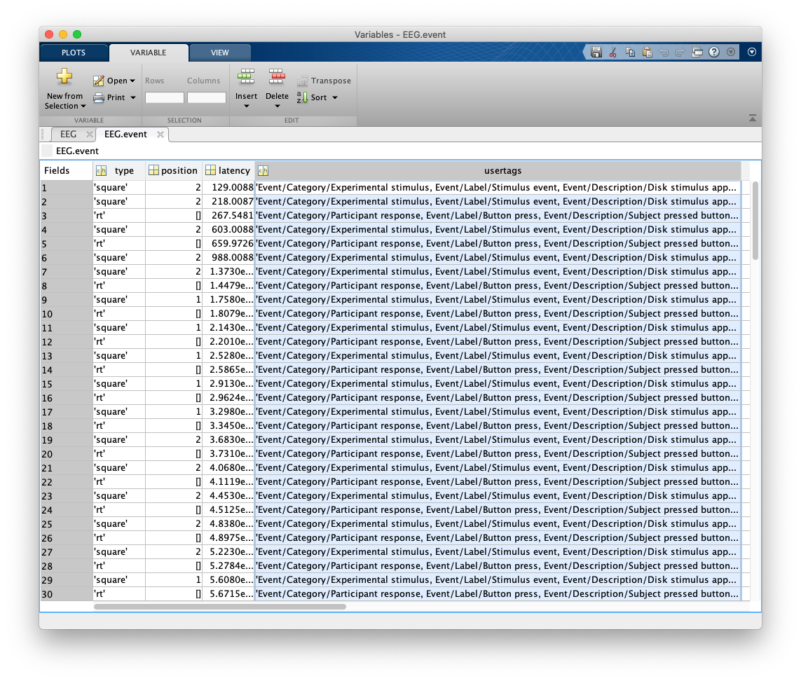
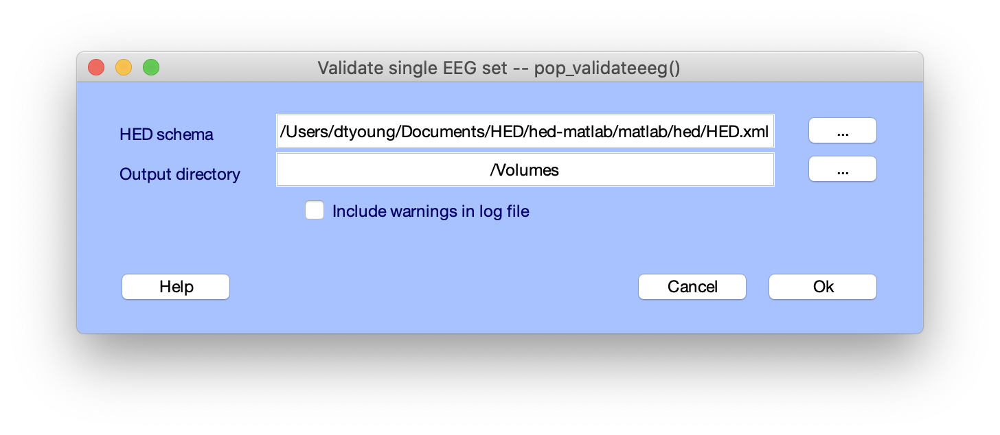
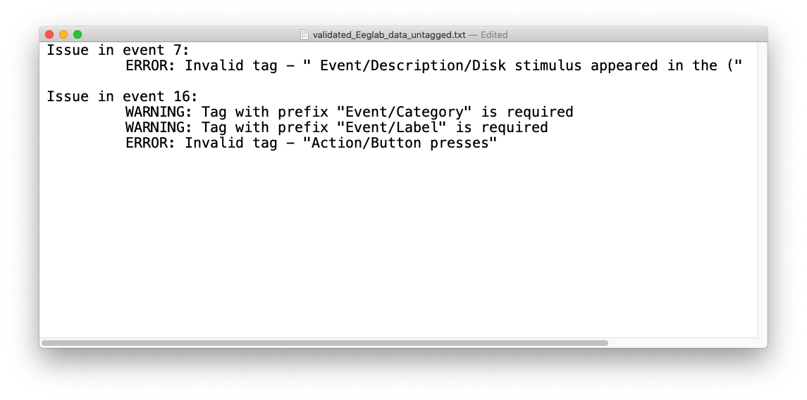

**Events Should Have HED Tags**:  Traditionally, software systems for event-related EEG data collection and analysis have used simple numeric codes (like 17, 129, etc.) whose meaning is hopefully saved with the data somewhere ("What does '*Event code 17* mean in this dataset??"). Else, event types are given brief but vague text labels ('*Target*'). With the recent rapid creation and increasing availability of new analysis methods for extracting information from collections of data, EEG data now have value long after their first publication. This becomes even more the case as, in near future, public *data, tool, and compute resources (DATCORs)* housed on available clouds or high-perrormance (super) computer networks are created and made available to a new wave of researchers trained in using biophysical, statistical, and machine learning methods to extract new information from the data. Archiving data in private or public DATCORs allows further and/or intensive data analyses of the original experiment data. It also allows new meta-analysis across studies having different experimental designs. All of this requires that the more exact natures of the *recorded experimental events* are saved and made accessible in an agreed format. 

Today the *only* such ystem for describing experimental events in brain imaging experiments is the **Hierarchical Event Descriptor (HED)** system of Nima Bigdely-Shamlo, first developed at the Swartz Center, UC San Diego (Bigdely-Shamlo et al., 2013) and fruther developed with Kay Robbins and her students at UT San Antonio (Robbins et al, 201?; Bigdely-Shamlo et al., 2016). The HED standard has been accepted in the rapidly emerging BIDS standards for archiving human brain imaging data of all types. In conjunction with a project to build a ('NEMAR') DATCOR for human neuroelectromagnetic data under NIMH funding, we (Scott Makeig, Arno Delorme, Amit Majumdar, Russ Poldrack) and  colleagues are creating and polishing tools 1) to make adding the more detailed HED tag descriptions of experimental events to new or existing data sets as simple as possible, and 2) to use HED tags within the EEGLAB signal processing environment for eelctrophysiological data (sccn.ucsd.edu/eeglab) to build custom collections of event-related data epochs based on details of the HED event descriptions (a simple example, to gather a collection of event-related data epochs time locked to screen presentations of green versus red visual stimuli across a set of archived HED-tagged EEG studies). An attractive target of such research is to discover EEG-based *biomarkers* of disease status or proclivity. 

The HED system is intended to continue to evolve (the HED developers are now preparing to release HED v3), and to be readily adaptable to serve the specialized interests of researchers, laboratories, consortia, or subfields. While a number of EEG studies have been archived in BIDS format with HED-tagged events, the field of EEG research as a whole yet knows little or nothing of HED or its uses. Thus, the HED developers face something like a 'chicken and eeg' problem. Without understanding how to use HED to extract new information from their data, other researchers will naturally have little interest in working to add HED tags to their (new) recorded or (exiting) archived datasets. The HED team is thus now working to build and make available a corpus of HED=tagged studies, while at the same time enhancing online HED tutorial guides and videos and refining and teaching the use of the existing software library of  HED tools.

**HED Tagging**: Most people who have worked with EEG data are familiar with the practice of using brief (and thus, vague) and lab- or study-specific labels (*'Target'*) or arbitrary integers (*'event type 17'*) to record the nature of experimental events occurring during an EEG, MEG, or iEEG experiment. Using such a dataset for analysis thus involves first (hopefully) locating and reading the reported experiment description carefully to gain a more detailed sense of the meaning of the saved event codes or labels. However, the lack of detail in stored numeric event codes and event labels (to some extent, even in initial publications on the data) prevents researchers from flexibly combining events across studies based on the precise nature of the experimental events (questions such as: *'Are green stimuli processed differently than red, no matter their shape?'*, *'Is there any EEG biomarker of the participant having heard a natural sound (such as a bird call) rather than a synthetic sounded (such as a sine tone)?'*). Nor are researchers able to most efficiently evaluate which events to include in their analyses (e.g. to fulfill goals such as, *'Only the blue targets'.*). Meanwhile, the increasing momentum and success of various data sharing efforts now begin to allow EEG researchers to access an increasing number of datasets from studies involving different designs. This opens the possibility of applying advanced machine learning approaches to analyze EEG dynamics based on a larger and more diverse scale of data. Unfortunately, these possibilities are highly restricted by the constraints imposed by the current practice of experiment event annotation.

**The HED System**:The *Hierarchical Event Descriptor (HED)* system provides a standardized way to describe more precisely the nature of recorded or later identified experimental events. Using HED-tagged datasets, researchers will no longer have to interpret stored, meaningless event codes or vague text labels. Detailed event descriptions, in a syntax that is both easily readbale to humans and computer programs, will be stored within the archived data itself. HED-informed analysis tools can then easily select and aggregate HED-tagged events of any description *across* any number of archived studies, with minimal human supervision. The HED system comprises a schema (syntax and agreed upon top-level tag hierarchy) and a software ecosystem supporting annotation, validation, and extraction of experimental events using HED tags. The [*HED schema*](http://www.hedtags.org/display_hed.html) specifies a collection of HED tags in use to annotate events, organized in a partially hierarchical structure. Software supporting the use of HED event tagging currently includes the EEGLAB plug-in library of [*HEDTools*](https://github.com/hed-standard/hed-matlab/tree/master/EEGLABPlugin), the GUI-based tagging program [*CTAGGER*](https://github.com/hed-standard/hed-java/blob/master/java/tagging/CTagger.jar) (now bundled with the *HEDTools* plug-in), and the online [*HED validator*](http://visual.cs.utsa.edu/hed/validation). The *HEDTools* plug-in for EEGLAB makes the tools callable from both the MATLAB command-line and from the EEGLAB main window menu.

**Using HED and HEDTools**: This guide will focus on the EEGLAB plug-in *HEDTools* for experimental event annotation, validation, and identification using HED tags. After reading this guide, you will get more familiar with the HED Schema and how to associate HED tags with events in existing data, either manually or using *CTAGGER*. 

[I. Event annotation & extraction with EEGLAB plug-in *HEDTools*](#I)

1. [Installing *HEDTools*](#I.1)
2. [Load dataset and start tagging](#I.2)
3. [Adding tags using CTAGGER](#I.3)
4. [Validating tagged dataset](#I.4)
5. [Extracting HED-annotated events](#I.5)

## <a name="I">I. Event annotation & extraction with EEGLAB plug-in *HEDTools*</a>
#### <a name="I.1">1. Installing *HEDTools*</a> 

[EEGLAB](https://sccn.ucsd.edu/eeglab/index.php) is the most widely used EEG software environment for analysis of human electrophsyiological (and related) data. It combines graphical and command-line user interfaces, making it friendly for both beginners who may who prefer a more flexible, visual, and automated way of analyzing data, and experts, who can easily customize and extend the EEGLAB tool environment by writing new EEGLAB-compatible scripts and functions, and/or by publishing EEGLAB plug-in toolboxes that are then immediately callable from the EEGLAB graphic user interface (GUI) menu or MATLAB commandline of anyone who downloads them.

The plug-in *HEDTools* for EEGLAB can be installed using one of the following ways:

1. From the EEGLAB Extension Manager: Launch EEGLAB and go to **File -> Manage EEGLAB extension**. The extension manager GUI will pop up. From this GUI look for and select the plug-in *HEDTools* from the main window, then click into the *Install/Update* button to install the plug-in.
2. From the web: Download the zip file with the content of the plug-in *HEDTools* either from [GitHub](https://github.com/hed-standard/hed-matlab/blob/master/EEGLABPlugin/HEDTools2.5.0.zip) or from the EEGLAB [plug-ins summary page](https://sccn.ucsd.edu/eeglab/plugin_uploader/plugin_list_all.php). Decompress the zip file into the folder *../eeglab/plugins* and restart the *eeglab* function in a MATLAB session.

#### <a name="I.2">2. Load dataset and start tagging</a>

In this quick guide, we will first use the simple EEGLAB tutorial dataset, which you can download [here](https://sccn.ucsd.edu/mediawiki/images/9/ simple9c/Eeglab_data.set). Once you have opened the EEGLAB main window, load the dataset by clicking on the **File > Load existing dataset** menu item, then selecting the tutorial dataset you just downloaded. 

Read a description of the dataset and of its included event codes by selecting **Edit -> About this dataset**:

Our goal in using HED tags is to describe the experimental events that are recorded in the *EEG.event* data structure in sufficient detail that anyone using the dataset in the future will not need to find and read a separate, detailed description of the dataset or study to understand the exact natures of the recorded experimental events

#### <a name="I.3">3. Adding tags using CTAGGER</a>

From EEGLAB menu, select **Edit -> Add/Edit event HED tags**, which will bring up a text entry window allowing you to specify options for tagging:

Here we will proceed using the default options, which use the latest version of the official HED schema. Users have the option to provide the path to a *tagfile* which contains a previously prepared mapping between event codes and HED tags (we will save one at the end of our tagging session). If a *tagfile* is provided, *HEDTools* will import the HED tags before letting you add new tags and/or modify them. The first two checkboxes let you use *CTAGGER* and its event field selector panel for tagging (more details below). Finally, if the last checkbox is selected, users can add new HED-compliant tags for their specific use-cases that HED has not covered. For this dataset, the current HED schema is sufficient. Click **Ok** to continue.

A window will pop up to let you choose which field in the *EEG.event* structure to use for tagging:

Fields listed in the select box are extracted from the *EEG.event* fields, ignoring other EEG structure fields (*.latency*, *.epoch*, and *.urevent*). *Primary field* is the field used to specify the type of the event; the other fields are subfields used to specify conditions or subcategories within the event. In most EEGLAB dataset structures, *EEG.event.type* is the primary field and the first field we want to tag. Select "*type*" in the select box and click **Tag** which will open up *CTAGGER*:

CTAGGER (for 'Community Tagger') is an application written in Java to faciliate the process of adding HED tags to recorded events in existing datasets. Through its GUI, users can explore the HED schema, quickly look up and add tags (or tag groups) to the desired event codes, and use import/export features to reuse tags on other datasets (e.g., other datasets from the same study). On the left side, the **Data Events** panel contains values of the selected event field and their associated tags. The right panel **Schema Tags** contains all available tags organized defined in the HED schema hierarchy. The process of tagging is then to simply choose tags from the schema to associate with each event code. 

First we will add a short label and a detailed description to the event codes using tag *Event/Label* and *Event/Description*. These tags are meant for human readability and will be ignored during machine processing. A restriction in HED tags is that tag values must not contain a comma (a common mistake in beginner event descriptions). Next, we want to generally categorize these events using tag *Event/Category*.  We will use the tag *Event/Category/Experimental stimulus* for stimulus presentation events (here, "*square*" events) and  *Event/Category/Participant response* for participant response events (here, "*rt*" events). 

With this information, the dataset can now be shared; any researcher who uses the dataset can understand, quickly and easily, the meaning of the recorded events. However, the larger goal of HED is to capture the nature of the events to any (hopefully, fine) level of description, so that analysis tools can then automatically aggregrate events using tags with minimal human supervision. So let's keep tagging!

Let us begin with the *partcipant response* events. We denote the type of action participant performed using *Action/* tags. As in this experiment the subject was asked to press a button as quickly as possible whenever they saw a '*target*' stimulus, we use *Action/Button press* to describe the basic nature of the event. We also asked subjects to use their right thumb to press the button, which we will capture using  *Participant/Effect/Body part/Arm/Hand/Finger/Thumb* and *Attribute/Object side/Right*. We'll put those two tags in a "tag group", which is used to group *Attribute/* tags with the item they describe. 

The illustration below shows how to add additional tags to event values, create a new tag group, and use CTAGGER's search functionalities. The search bar in the **Data Events** panel let you quickly look up and directly add a tag to the selected event value. Users can also use the **Schema Tags** panel's search bar to explore tags in the HED schema and hover a tag to read its description when applicable. 

Next, we describe the recorded stimulus presentation events. We capture how the sensory stimulus was presented to the participant using a *Sensory presentation/* tag. In this case visual stimuli were presented on a (2D) computer screen, so we use *Sensory presentation/Visual/Rendering type/Screen/2D*. We also want to describe the intended effect of the stimuli on the participant. To describe the imperative effect that the stimulus presentation has on the subjects (prompting them to make button press), we'll add a tag group (*Action/Button press, Attribute/Intended effect*). Furthermore, since subjects were asked to explicitly pay attention to presentations of target squares, with time pressure to make a quick button press response, we use tags *Participant/State/Attention/Covert* and *Participant/State/Under time pressure*. At this point the *CTAGGER* window should look like this:

We also want to describe the nature of the presented stimulus itself. In this study, the stimulus is a black disc presented suddenly in any of five boxes spaced evenly on a horizontal plane above the center fixation cross. The tutorial sample dataset only includes event-related epochs in which the disk appeared in the two left-most squares, annotated by event field "*position*". To include screen position information in the stimulus description, we will use tag field *"position"*. As we have finished tagging the field *"type"*, press **Ok** in the current *CTAGGER* window. The field selection window becomes active again; this time we choose *"position"* before pressing **Tag**. The *CTAGGER* window will appear again, this time with *"position"* event values *"1"* or *"2"*, indicating that the stimulus appeared within squares centered, respectively, about -5.5 degrees and -2.7 degrees (screen's left field) of horizontal visual angle from screen center.

To describe the screen-centered fixation cross, we'll use the tag group (*Item/2D shape/Cross, Attribute/Visual/Fixation point, /Attribute/Location/Screen/Center*). The black circular disc stimulus can be described using tags */Item/2D shape/Ellipse/Circle*, */Attribute/Visual/Color/Black*, and */Attribute/Size/Area/1.4 cm2*. We also want to include information about the disc's specific positions. For events with position value "1", we add tags *Attribute/Location/Screen/Center displacement/Horizontal/-5.5 degrees* and *Attribute/Location/Screen/Center displacement/Vertical/0.8 cm* to describe the disc's horizontal and vertical visual angle displacement from screen center, respectively. For events with position value "2", we'll add *Attribute/Location/Screen/Center displacement/Horizontal/-2.7 degrees* and *Attribute/Location/Screen/Center displacement/Vertical/0.8 cm*. We have described the stimulus presentation events.

Click **Ok** on CTAGGER window and **Ok** on the field selection window. A window will pop up asking if you want to save the **field map**. Field map is the mapping between all event codes and their associated HED tags that we just added. If saved, you can re-import it to another dataset with similar event codes (as shown above for the CTAGGER input window). Click **Ok** when you're done. 

A last window will pop up asking what you would like to do to the newly tagged dataset and the old, untagged, dataset. You can choose to overwrite the old dataset with the tagged one or save new dataset as a separate file. Click **Ok** when you're done. 

You just finished tagging! *HEDTools* generates the final HED string for each event by concatenating all tags associated with the event values of that event, seperated by commas, and put the string in a new field **usertags**. You can check this by opening up EEG.event in MATLAB variable window:

#### <a name="I.4">4. Import tags from external field map file and Validating a HED-tagged dataset</a>

Using CTAGGER gives you confidence that your tags are HED-compatible and the dataset is ready for use. However, sometimes you might want to reuse tags already produced by others. In EEGLAB, load the dataset you want to import the tags to and chose the menu **Edit > Add/Edit event HED tags**, which will bring up the tagging input window introduced above. Click on the browsing button next to the **Import tag file** input box and choose the field map (default name *fMap.mat*) file you want to reuse for your dataset. Then unselect the option to use CTAGGER if you do not wish to edit tags. After the tags are imported, you will have the option to resave the dataset and/or overwrite it in the working memory.

A good step to do right after is to validate the imported tags. Go to **Edit > Validate event HED tags**. A window will pop up for you to review and edit validation options:

**HED schema** input field allows you to choose the schema to validate the tags against. By default it's the schema provided with the plugin. Validation result will be saved as a file in the specified **Output directory**, which defaults to the current MATLAB directory. Make sure to select the directory in which you have write permission. Lastly, the option to **Include warnings in log file** is toggled on by default, informing users about any unfulfilled tagging recommendations. Click **Ok** to continue.

*HEDTools* will validate the tags in the current EEG set using the input options provided above. When done, you can look into the specified output directory for validation result file, whose name will be "validated_[dataset_name].txt". If there's no issue with the dataset, you will see only one line in the file, saying "No issues was found." Otherwise, for each issue there will be two line printed, the first one for the location at which the issue occurs and second line detailing the issue. Here are an example of validation log file with issues:

#### <a name="I.5">5. Extracting HED-tagged events and event-locked data epochs from an EEGLAB dataset</a>

The EEGLAB *pop_epoch* function extracts data epochs that are time locked to specified event types. This function allows you to epoch on one of a specified list of event types as defined by the *EEG.event.type* field of the EEG structure. *HEDTools* provides a simple way for extracting data epochs from annotated datasets using a much richer set of conditions. To use HED epoching, you must have annotated the EEG dataset with HED tags stored in the *.usertags* and/or *.hedtags* fields under the *EEG.event field* of the dataset. If the dataset is not tagged, please refer to [section I.3](#I.3) on how to tag a dataset.

Start by choosing the menu option **Tools > Extract epochs by tags**:

This will bring up a window to specify the options for extracting data epochs:

The *pop_epochhed* menu is almost identical to the EEGLAB *pop_epoch* menu with the exceptions of the first input field (**Time-locking HED tag(s)**) and the second input field (**Exclusive HED tag(s)**). Instead of passing in or selecting from a group of unique event types, the user passes in a comma separated list of HED tags. For each event all HED tags in this list must be found for a data epoch to be generated. Clicking the adjacent button (with the label …) will open a search tool to help you select HED tags retrieved from the dataset.

When you type something in the search bar, the dialog displays a list below containing possible matches. Pressing the "up" and "down" arrows on the keyboard while the cursor is in the search bar moves to the next or previous tag in the list. Pressing "Enter" selects the current tag in the list and adds the tag to the search bar. You can continue search and add tags after adding a comma after each tag. When done, click the **Ok** button to return to the main epoching menu. 

Exclusive tags negate matches to other tags that are grouped with them. In order for a match to be returned the exclusive tag must be specified in the search string also. By default, there are three exclusive tags: *Attribute/Intended effect*, *Attribute/Offset*, and *Attribute/Participant indication*.

Another thing to keep in mind is that the matching works differently when specifying non-exclusive tags that are attributes (_Attribute/*_ tags). If an attribute tag is specified in the search by itself then it needs to be present at the top-level of the event tags, the top-level and all tag groups, or in all tag groups if there are no top-level tags. 

Here are a few examples applied on part of the HED string produced by our previous tagging to help clarify the way that the search works. Here the event tags are printed in their separate lines to make it easier to read. We will leave the exclusive tags list as default, which include *Attribute/Intended effect*.

Event tags:

"Event/Category/Experimental stimulus, 

Participant/State/Attention/Covert, 

Participant/State/Under time pressure, 

Sensory presentation/Visual/Rendering type/Screen/2D, 

(Action/Button press, Attribute/Intended effect),

(Attribute/Location/Screen/Center displacement/Horizontal/5.5 degrees, Attribute/Location/Screen/Center displacement/Vertical/1.8 degrees, Attribute/Size/Area/1.4 cm2, Attribute/Visual/Color/Black, Item/2D shape/Ellipse/Circle)"

**Example 1**: Partial match found. 

Search tags: Participant/State/Attention 

Result: True 

**Example 2**: Match found but offset because exclusive tag isn’t specified in search. 

Search tags: Action/Button press

Result: False 

**Example 3**: Match found but offset because exclusive tags need to be grouped with other tags. 

Search tags: Participant/State/Under time pressure, Attribute/Intended effect 

Result: False 

**Example 4**: Match found but offset because attribute tags are found in group but not found at the top-level and the whole group doesn't match. 

Search tags: Attribute/Visual/Color/Black, Attribute/Size/Area/1.4 cm2 

Result: False 

**Example 5**: Match found because a whole group is matched even though it doesn’t match the other group 

Search tags: Action/Button press, Attribute/Intended effect

Result: True
